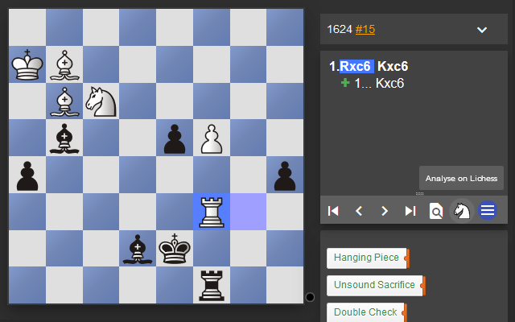

Analyse ChessTempo Puzzles on Lichess
=====================================

A browser extension that adds a button to the ChessTempo interface to quickly
open a puzzle on the Lichess analysis board.

Installing in Chrome or Firefox
-------------------------------

Grab the latest version from the [GitHub releases page](https://github.com/alexbarrett/analyse-chesstempo-on-lichess/releases). Further instructions are listed there.

Building browser extensions from source
---------------------------------------

`npm run build` will generate a zip file. It can be installed in Chrome by
navigating to chrome://extensions and dragging the zip into the tab.

`npm run sign` will sign the zip and generate an XPI file which can be installed
in Firefox. It requires two environment variables which must be retrieved from
[addons.mozilla.org](https://addons.mozilla.org).

    WEB_EXT_API_KEY=<api-key> WEB_EXT_API_SECRET=<api-secret> npm run sign
